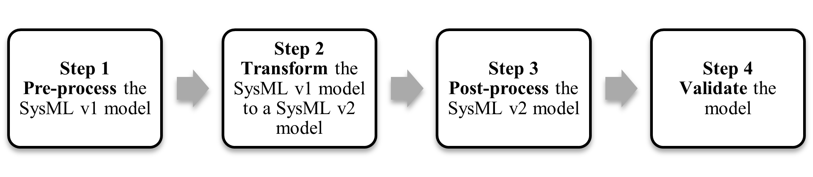

<!-- Source: https://www.omgwiki.org/MBSE/doku.php?id=mbse:sysml_v2_transition:model_conversion_approach -->

[[Click Here](http://www.omgwiki.org/MBSE/doku.php?id=mbse:sysml_v2_transition)] to return to the INCOSE SysML v1 to SysML v2 Transition Guidance Activity Team Home Page

## SysML v1 to SysML v2 Model Conversion Process

[Download](https://www.de-bok.org/asset/5bd90f82fab101bdf093103f76ce74ec5411300e)

---

*Content derived from OUSD (R&E) publicly available material*

Figure 1 shows the steps in the conversion process from a SysML v1 model to a SysML v2 model which includes: (1) pre-process the SysML v1 model to prepare it for the transformation, (2) transform the SysML v1 model to a SysML v2 model, (3) post-process the SysML v2 model to better leverage the SysML v2 capabilities, and (4) validate that the SysML v2 model accurately reflects the intent of the SysML v1 model.

 
Figure 1 Model Conversion Process

In addition, further steps may be required to assess the impact of the SysML v2 model on existing artifacts that were derived from the SysML v1 model. The derived artifacts may need to be updated for the SysML v2 effort, but this is considered outside of the scope of the SysML v1 to SysML v2 model conversion. Each of these steps is summarized below.

#### Step 1 Pre-process the SysML v1 Model

This step involves pre-processing the SysML v1 model to prepare the model for transformation. The required pre-processing will depend on the transformation capability that the modeling tool provides, so it is important to understand the tool capability and limitations. Performing the standard SysML v1 to SysML v2 model transformation requires that the SysML v1 model conform to the SysML v1 specification, so the pre-processing should ensure that SysML v1 model conforms to its specification. Any tool-specific extensions along with other tool customizations to the model may need to be removed. However, the use of stereotypes and profiles are expected to be supported by the transformation. 

Certain features of SysML v1, such as adjunct properties, are not incorporated in SysML v2. Part of the pre-processing could be to remove these elements or assess the impact of the transformation on these features and note that they may need to be addressed in the post-processing step. 

Circular dependencies should be identified to determine if and how they may impact the transformation and addressed accordingly. The SysML v1 model may also need to be reorganized to enable an incremental conversion process. 

Creating a well-formed SysML v1 model that conforms to good practice will facilitate the conversion process. Model validation errors should be resolved to ensure the model is well-formed. Standard modeling conventions should be applied such as consistent naming conventions and ambiguities and redundancies in the model should be minimized.

#### Step 2 Transform The SysML v1 Model to a SysML v2 Model

This step involves transforming the pre-processed SysML v1 model to a SysML v2 model. A SysML v1 model can be transformed to a SysML v2 model using a tool that can execute the standard SysML v1 to SysML v2 transformation specification. The standard transformation requires that the SysML v1 model be conformant to the SysML v1 specification to be transformed to a conformant SysML v2 model. 

The SysML v1 to v2 transformation specification defines the rules for transforming each kind of element in SysML v1 to a corresponding element in SysML v2. The transformation also includes rules for cases where there is no corresponding SysML v2 element. For example, a block in SysML v1 includes a meta property called 'isEncapsulated'. There is no equivalent concept in SysML v2 since the SysML v2 language designers did not see a need for this. However, there is a rule for how to address this in the transformation. 

The tool should generate validation errors and warnings to indicate what aspects of the transformation were not successful. In addition, a manual inspection should be performed to compare the SysML v2 model with the SysML v1 model.

#### Step 3 Post-process the SysML v2 Model

This step involves post-processing the SysML v2 model to leverage the SysML v2 capabilities. The transformed SysML v2 model may need to be reorganized and refactored to fully leverage the SysML v2 capabilities. The reorganizing and refactoring should apply the usage-focused modeling paradigm which is briefly discussed in the section entitled “Post-process the SysML v2 Skyzer model.”

#### Step 4 Validate the Model

It is imperative to validate that the SysML v2 model accurately reflects the intent of the SysML v1 model. This can be done by comparing the two models. This may include reproducing selected views of the SysML v2 model such as a system hierarchy and carefully comparing it with the system hierarchy in the SysML v1 model. It is anticipated that tool vendors may be able to generate automated comparison reports to assist in the inspection. Comparing execution and analysis results from the SysML v2 model with the corresponding execution and analysis results from the SysML v1 model may also assist in the validation. (Note: SysML v2 execution semantics are still being specified as of the date of this writing).

A tool is expected to support the SysML v2 standard views which can render similar information that is contained in the nine standard SysML v1 diagrams. However, the layout information is not preserved and may need to be adjusted manually to align with the original SysML v1 diagram.

## Other Considerations in the Model Conversion Process

#### 1 Whether to Convert

Before making the conversion, a project may want to evaluate the cost of converting a SysML v1 model to a SysML v2 model versus the cost of developing a new SysML v2 model from scratch. It may be more cost-effective to start from scratch if the SysML v1 model was not maintained, or if its scope of the SysML v1 model is not consistent with the current effort. analysis, test plans, and others.

#### 2 Incremental Model Conversion

Projects should perform the conversion process incrementally rather than as a one-time process. As part of the pre-processing, the SysML v1 model can be partitioned to reduce the coupling between the parts of the model that will be incrementally transformed. For example, the model can be partitioned into packages that contain the structure, behavior, and requirements and further partitioned into mission, system, and subsystem levels. The incremental conversion process may first transform the structure, then transform the behavior, and then transform the requirements.

#### 3 One-Way Transformation

The transformation occurs in a one-way direction from SysML v1 to SysML v2. There is no standard to transform a SysML v2 model to a SysML v1 model because many of the capabilities in SysML v2 are not supported in SysML v1. For example, SysML v1 supports a block decomposition but does not support a SysML v2 part decomposition.

#### 4 Classified Models

The transformation of a classified SysML v1 model should preserve all classification markings in the SysML v2 model. A standard security extension should be applied that leverages the metadata capability in SysML v2. A project should define a process to ensure all markings are properly applied and includes manual inspection of the model. The same classification procedures that apply to the SysML v1 model should apply to the SysML v2 model. 

#### 5 Configuration Management

Projects can apply the SysML v2 API configuration management services to the SysML v2 models beginning with the initial transformation. Typical branch and merge concepts can be used to manage updates to the model. The configuration management of the SysML v2 model should be incorporated into the broader life cycle management environment using workflow or issue management applications such as Jira.

*Content derived from OUSD (R&E) publicly available material*
