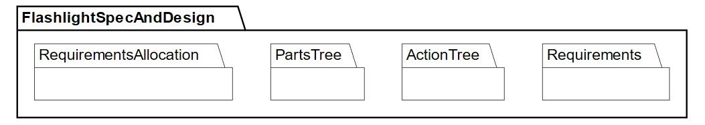
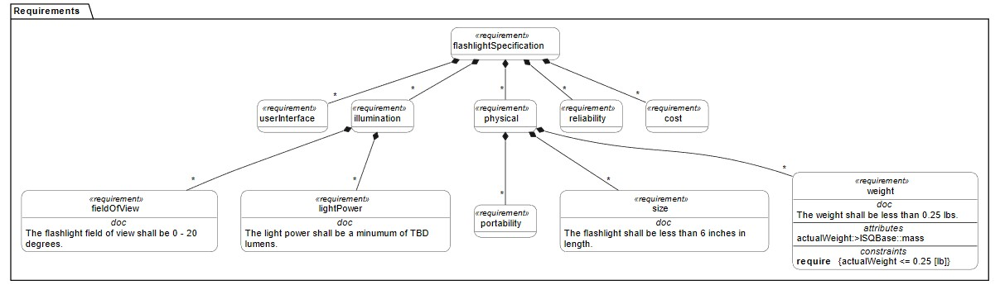
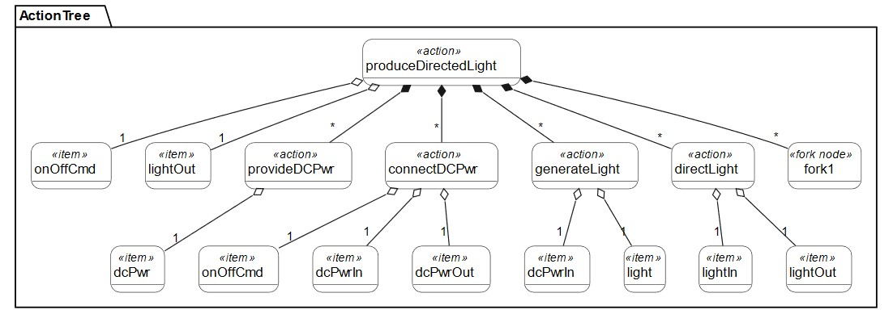
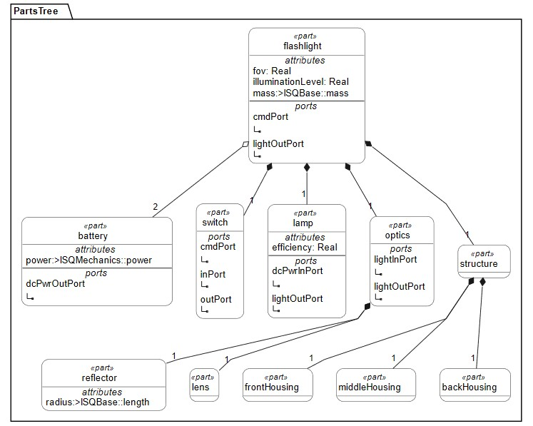
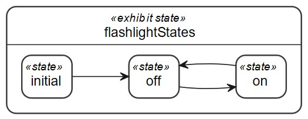

<!-- Source: https://www.omgwiki.org/MBSE/doku.php?id=mbse:sysml_v2_transition:sysml_v2_starter_model -->

[[Click Here](https://incose.github.io/sysml-v2-wiki/)] to return to the INCOSE SysML v1 to SysML v2 Transition Guidance Activity Team Home Page

# SysML v2 Flashlight Starter Model

*Content derived from OUSD (R&E) publicly available material*

This page includes a short description of the SysML v2 Starter Model with a link to a Starter Model Overview Presentation. The model is intended to introduce some basic features of SysMLv2 and encourage further exploration of the language. The Starter Model is a model of a simple flashlight and includes short descriptive annotations within the model.

SysML v2 includes both a textual and graphical syntax. The Starter Model is modeled using the open-source Jupyter Lab modeling environment which is primarily a text-based modeling editor. Some limited graphical visualization is available using the Plant UML Plugin integrated with Jupyter. Some limited example graphical views that are generated using the Plant UML plugin are included below. Recognize that many commercial modeling tools will provide full support for modeling with both the graphical and textual syntax, which are complementary renderings of the same underlying model.

Note:  To use the starter model, a Jupyter Lab modeling environment must be set up.  Instructions are available [here](https://incose.github.io/sysml-v2-wiki/modeling-environment/).

Alternatively, any SysML v2 modeling tool can be used if it supports the textual notation conformant with the SysML v2 specification. The SysML v2 Flashlight Starter Model Text File (i.e. .sysml file) can be imported into the tool. 

The following model files have been **updated** to be based on the SysML v2 Specification 2025-04 release and associated reference implementation.

[SysML v2 Flashlight Starter Model Overview Presentation](https://www.de-bok.org/asset/45a09d62209810afce38cfa49a5a95d01d2fc2e7)  
[SysML v2 Flashlight Starter Model Jupyter Lab File (.ipynb)](https://de-bok.org/asset/4b8e819b5446ad999551e7d68c625e7d75f83f9f)  
[SysML v2 Flashlight Starter Model Text File (.sysml)](https://de-bok.org/asset/39898415908a48350628209d59522add76acdfd1)

---

# Highlights

The Flashlight Starter Model includes the following: 
  
Model Organization:  The model organization includes packages for Requirements, Actions, Parts and Requirements Allocation.

  
Requirements Tree:  The flashlight specification is modeled as a hierarchy of requirements.

  
Action Tree:  The flashlight performs the action to produce directed light which is decomposed into an action tree. The decomposition also shows the inputs and outputs for each action.

  
Parts Tree:  The parts tree provides a breakdown of all of the systems parts. 

  
States:  The flashlight state-based behavior includes the on state and off state and transitions between them.

Upon completing the flashlight starter model, test your knowledge by adding a requirement for a new state (e.g., flashing), and/or other new requirements.  You may also want to generate a SysML v1 model for comparison purposes.

Refer to the specifications and the following tutorials available under doc folder at https://github.com/Systems-Modeling/SysML-v2-Release to further explore the language  
Intro to the SysML v2 Language – Textual Notation  
Intro to the SysML v2 Language – Graphical Notation

*Content derived from OUSD (R&E) publicly available material*
