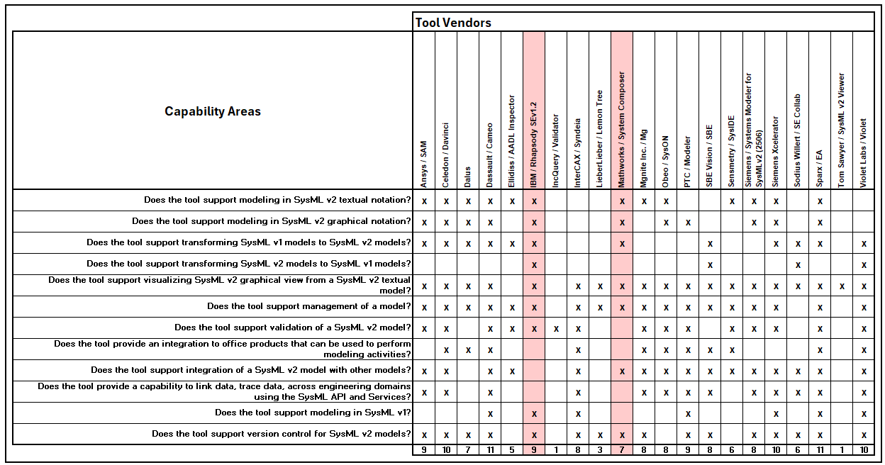

<!-- Source: https://www.omgwiki.org/MBSE/doku.php?id=mbse:sysml_v2_transition:incose_mbse_iw_2025:tool_capability_summary -->

## SysML v2 Tool Capability Summary

The following is a compilation of features from each of 20+ available SysML v2 tool vendors. The list is expanding to include other vendors as we collect responses. This data was sourced directly from each vendor, **with the exception of the columns highlighted red**, data for which was sourced from the vendor's 2025 INCOSE IW tool video by the OUSD R&E team. This document is intended to be a starting point to help narrow down possible helpful tool options, not a definitive method for choosing a tool. 

To add your tool to this list, please complete the [Tool Capability Input Form](https://forms.osi.apps.mil/r/WJh0ZkseTR).

Data in this matrix is subject to change. Latest update: 08-21-2025. Click the image to open a larger view.

For a version of this data which includes comments from the vendors on each question, see the file below.

[SysMLv2 Tool Capability Summary](https://www.de-bok.org/asset/2296c0db2d3db26f126f6a76f5f5885d9ce0d77b).

*Content derived from OUSD (R&E) publicly available material*
