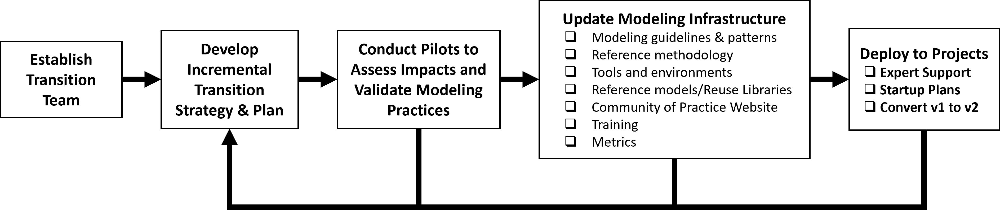

<!-- Source: https://www.omgwiki.org/MBSE/doku.php?id=mbse:sysml_v2_transition:sysml_v1_to_sysml_v2_transition_guidance -->

# SysML v1 to SysML v2 Transition Plan Outline and Recommendations

[Download](https://www.de-bok.org/asset/a61d03838798c10b96f10d868e40012e8f451f53)

## 1 Overview

This document is an outline with recommendations for planning an organization’s transition from Systems Modeling Language (SysML) Version 1 (v1) to SysML v2. Users should tailor this document based on specific transition objectives, the current state of model-based systems engineering (MBSE) practice, the organization’s size and resources, and other factors.

SysML v2 is the next generation Systems Modeling Language to support the evolving practice of MBSE and to address the challenges of increasing system complexity and technology changes. The objectives for SysML v2 are to increase MBSE effectiveness and MBSE adoption over SysML v1 by making significant improvements in language precision, expressiveness, regularity, interoperability, usability, and extensibility. SysML v2 is intended to enable program MBSE efforts to realize improved system quality through early verification and error detection, and improvements in agility and productivity through broad-based reuse, while reducing development cost, schedule, and risk by providing a shared and precise understanding of the system as it evolves across its life cycle.

SysML v2 incorporates a new metamodel that designed to address the needs of system modeling while leveraging the capabilities of the Unified Modeling Language (UML) metamodel upon which SysML v1 was based. SysML v2 also includes a textual notation in addition to a graphical notation that facilitate increased precision of the language. SysML v2 includes a standard application program interface (API) to enable interoperability between the system model in SysML v2 and other models and tools that are part of the digital engineering ecosystem.

These changes in the modeling language are significant and will require careful and deliberate planning to mitigate risks and to ensure an efficient change approach is taken.

*Content derived from OUSD (R&E) publicly available material*

## 2 Transition Planning Approach

The process for transitioning an organization’s MBSE practices and skill base from modeling with SysML v1 to modeling with SysML v2 is shown in Figure 1. The transition plan is intended to lay out how an organization executes this process. The primary objectives for the organization are to ensure their modeling infrastructure is in place to enable their programs and projects to effectively apply MBSE with SysML v2. This process should be executed incrementally to provide their modeling capabilities. 

  
*Figure 1 SysML v1 to SysML v2 Transition Planning Process*

### 2.1 Establish a transition team

A transition team should be established to develop and execute the transition strategy and plans. This team should be integrated with other teams that are responsible for related digital engineering initiatives. The team should have the authority and responsibility to implement organizational change and include a team lead with representation from the business units and other parts of the organization that are transitioning to MBSE with SysML v2. The team should include members with the expertise needed to develop and evolve the MBSE infrastructure including the MBSE methodologies, tools, and training including expertise in both SysML v1 and SysML v2.

### 2.2 Develop the Strategy and Plans

The strategy should outline the high-level objectives, risks, approach, and key milestones for the transition.  The plan should define the activities to develop the incremental modeling infrastructure capabilities based on the priorities and available resources.  The plan should identify and allocate resources to the plan. The strategy and plan should be coordinated with the sponsor of the transition effort and other primary stakeholders and should be communicated broadly.
The strategy and plan should include nearer-term opportunities to demonstrate early success, along with mid-term and longer-term opportunities. For example, a near-term opportunity may be to demonstrate the value-added capabilities of SysML v2 in a pilot project. A mid-term opportunity may be to demonstrate the ability of a small team on a smaller program to support a successful System Design Review and Preliminary Design Review by establishing the model of the system architecture and requirements flow down. The longer-term opportunity may be to demonstrate that the architecture and more precise requirements reduced the cost of testing and downstream errors.
The strategy and plans should include support for both SysML v1 models and SysML v2 models which may co-exist for some time.

#### 2.2.1 Transition Objectives

The objectives are to transition from the current state of systems modeling with SysML v1 to the future state that enables the effective application of MBSE with SysML v2. The value proposition should be compelling and support the broader goals of the organization to improve productivity, quality, agility, and innovation. It should be clear how the organization’s investment is anticipated to yield project improvements.

#### 2.2.2 Transition Risks

There are risks associated with introducing the new SysML v2 modeling tools and integrations with other tools, changes in methodologies, and a workforce with limited experience using SysML v2. There is also risk associated with transforming the SysML v1 model to the SysML v2 model which could result in significant unanticipated effort and require changes to systems engineering work products. These risks can be mitigated by careful planning. The risks should decrease as the organization gains experience in transitioning to SysML v2.

### 2.3 Conduct Pilots to Assess the Impact on Current MBSE Practices

Identify pilot opportunities and provide the needed resources (e.g., funding, schedule, and expertise) to conduct the pilots. The pilots are used to assess the impact of SysML v2 on the organizations MBSE practices including methodology, tools, and training, and validate the proposed changes to the organizations MBSE practices.

The pilot should have clear objectives and may vary in size and scope.  A pilot may focus on assessing the impact on MBSE methodology, on MBSE tools, on integration with other methodologies and tools, or on specific modeling practices including modeling guidelines and patterns, or the approach to converting a SysML v1 model to a SysML v2 model. The results of the pilot assess the impact to current practice and validate the proposed changes to the practice.

The pilots require an initial modeling environment. The open-source pilot implementation can be used as a starter environment to introduce the team to SysML v2. Specific vendor tools can be used as they become available. The pilot offers an important opportunity to collaborate and provide feedback to the tool vendors.

The pilot should be staffed with team members that have the appropriate skillset. Initial SysML v2 training should be provided to the team members. The team will require on-going support from one or more individuals with SysML v2 expertise.

Each pilot activity should include identification and collection of key metrics that can be used by programs such as cost estimating metrics where applicable, and other metrics to track progress and the results of the improvement effort.

An example pilot project that was conducted to evaluate the application of a model-based systems engineering methodology called Object Oriented Systems Engineering Method (OOSEM) and a supporting tool suite is included in Steiner et al. (2016). Although the pilot was conducted several years ago, the systematic approach to conducting the pilot is still applicable and can serve as a reference for conducting other pilots.

Other typical pilot projects may address one or more of the following pilot objectives:

1.	Increase awareness of the SysML v2 Modeling Language and its differences with SysML v1  
2.	Learn the SysML v2 Modeling Language and build the workforce skill base  
3.	Evaluate current SysML v1 models to define criteria and assess there suitability for model conversion  
4.	Establish approach for converting SysML v1 models to SysML v2 models  
5.	Pre-process SysML v1 models to position them for successful transformation to SysML v2  
6.	Evaluate and recommend changes to existing methodology  
7.	Evaluate tools as they become available  
8.	Evaluate current customizations, integrations, plugins etc. and strategize their migration to SysML v2  
9.	Establish metrics to help manage the transition process and evaluate improvements  

### 2.4 Update Modeling Infrastructure

#### 2.4.1 Tool Evaluation and Selection

The transition team should conduct an evaluation of the candidate SysML v2 modeling tool vendors. Key criteria for the evaluation may include standards conformance to the language and API, usability, execution capability, visualization capability, documentation, and report generation, configuration and model management, integration with other engineering tools, performance, security, acquisition and maintenance costs, and tool support. Another key criterion is support for converting existing SysML v1 models to SysML v2 models. The selection should be deferred until the practitioners have had hands on experience with the modeling tool in the organization’s environment. As noted previously, the tool evaluation can be part of the pilot projects.

#### 2.4.2 Updating the Modeling Environment

The selected tool will need to be integrated into the overall modeling environment that often includes many other kinds of tools including requirements management, analysis, hardware and software design, testing, and project management tools. This integration is typically done incrementally based on the workflow priorities. 

In addition, there will be SysML v1 modeling tool extensions such as plugins and scripts that contain a broad array of customized concepts and functionality. Each extension will need to be assessed to determine if it is needed in SysML v2. Some plugins may be able to be replaced by standard SysML v2 language extensions. Other customizations may leverage the SysML v2 API to develop standardized applications that can interoperate with multiple tools.

The ability to support modeling in both a classified and unclassified environment should be considered. For example, the unclassified models can be considered project usages that can be used in a classified environment.

#### 2.4.3 Update Modeling Methodology and Practices

The results of the pilot projects can be used to update to the modeling practices that includes the modeling guidelines, patterns, and MBSE methodology. The MBSE methodology defines how the organization’s systems engineering process is performed using a model-based approach. The usage focused modeling approach should be considered when updating the methodology. This methodology serves as a reference methodology that programs can adapt and tailor to meet their needs.

#### 2.4.4 Update the MBSE Training

A training plan should be established that includes who should be trained and what level of training is required, when they should be trained, and how they should be trained. The level of training will vary from early awareness training across the broad community, to more specific training in the language, methodology, and tools that depend on the role of the person being trained. Just-in-time project-specific training can be tailored to the needs of a project.

#### 2.4.5 Update the Community of Practice Website/Repository

The modeling methodology, practices, tool guidance, and training content can be made available on an organizational repository for broad access and use. This augments the enterprise reuse repository containing reusable model assets. The organizational repository/website must be maintained with easily searchable content to be useful.

#### 2.4.6 Update Reference Architectures and Reusable Assets

As SysML v2 models are developed on programs, the models and updated practices can be evaluated by the organization to assess how these models and practices can be reused across the organization.  Reference architectures can be created for each relevant application domain (e.g., UAV, Command and Control System). This is done by creating logical abstractions and/or product lines that can be used as a basis for developing specific design configurations. In addition, component models can be specified, validated, and captured in reuse libraries. The access to the enterprise reuse repository may need to support different classification levels, where classified models can access unclassified models as project usages. A disciplined configuration management process is essential for effective reuse.

### 2.5 Considerations for Deploying SysML v2 to Programs

Some critical questions regarding the transition will be, which programs should transition from SysML v1 to SysML v2, when to transition, and whether to convert an existing SysML v1 model to SysML v2 or just leverage the SysML v1 model as an input to a new start.   

The question of whether to transition should be assessed for each program in terms of its positive and negative impacts on program cost, schedule, technical performance, and risk in the near, mid, and longer term.  Some legacy programs will continue to use SysML v1 for several years until SysML v1 tools are no longer supported. The introduction of SysML v2 should realize benefits that include reduced ambiguity of requirements, a more understandable and scalable model of the system architecture, a system model that is more interoperable with other engineering models and tools through the API, and significant improvements in maintainability and reuse of the system model. As noted previously, there are also transition risks associated with introducing the new SysML v2 modeling tools and integrations with other tools, changes in methodologies, and a workforce with limited experience using SysML v2. In addition, there are risks associated with converting the SysML v1 model to the SysML v2 model which could result in significant unanticipated effort and require changes to systems engineering work products.

The question of when to transition will also need to be assessed for each program.  The appropriate point in the program life cycle will need to be identified that minimizes risk and maximizes the benefits to the program in the near-term, mid-term, and long-term. Typically, the transition should occur during the proposal phase of a new program or program upgrade prior to contract award. This enables the systems modeling team to establish the practices and preliminary system model prior to contract award. However, if a program is already underway, then a transition could occur around a program milestone, such as a System Requirements Review, System Functional Review, Preliminary Design Review, or Critical Design Review. There would need to be a parallel effort leading up to the program milestone to establish the baseline SysML v2 model to insert at that point in the life cycle.

The question of whether to convert the SysML v1 model to a SysML v2 model or to leverage the SysML v1 model as an input to a new start depends in part on the current state of the SysML v1 model and the extent to which it satisfies the modeling objectives. For example, if the SysML v1 model is quite mature and satisfying the modeling objectives, then it is a good candidate for conversion. If the SysML v1 model is not considered to be a mature model and/or it is not satisfying the model objectives, then it may be preferred to leverage the SysML v1 model as an input but a new SysML v2 modeling start. In either case, the model conversion should be done incrementally and validated at each step (refer to the SysML v1 to SysML v2 model conversion process). The conversion of the existing SysML v1 model also depends on whether the current team was heavily involved in the development of the SysML v1 model or whether this a new team who had limited or no involvement in the development of the SysML v1 model.

An additional question is whether the entire model needs to be converted, or perhaps just a portion of the model. There may be cases where only a portion of the model needs to be converted to achieve the program objectives. For example, the new program may only be addressing selected subsystems and may not require the detailed model of all subsystems be converted, or the SysML v1 model may include parametric models to support analysis that may not be required of the SysML v2 model at this time.

### 2.6 Deploy MBSE with SysML v2 to Programs

Deploying MBSE with SysML v2 to a program should address the deployment considerations described previously. The program stakeholders must be involved in the decision and support the decision for this to be successful. The organization transition/improvement team should assist the program by providing the organizational infrastructure and technical support. 

The program stakeholders include the systems modeling team as well as other engineering disciplines who interpret and interact with the model. The stakeholders can cross organizational boundaries between acquirers and suppliers. For example, the stakeholders for a DoD acquisition program include both the government and contractor systems modeling teams. 

A plan for implementing MBSE with SysML v2 should be developed for each selected program. This includes establishing the modeling objectives and scope, tailoring the reference methodology, setting up the modeling environment, staffing and training the team in the language, methodology, and tools, and identifying the key modeling artifacts and their required maturity at each program milestone.

The modeling environment can leverage the organizational modeling environment but will need to be further adapted to meet the needs of the specific program. This includes additional integration with additional specialized tools and data repositories, and integration with the environment for both the acquirer and other subcontractors and suppliers. This also includes integration with the organizational product life cycle management environments to enable configuration management of the different engineering and management artifacts (e.g., the digital thread).

Different levels of training may be required for different roles. For example, a systems modeler who is developing the model will require more in-depth training than other engineering disciplines who may interpret and interact with the model. A task lead may require a different level of training to understand expectations from the model and properly task the effort.

The SysML v2 model will either be converted from the SysML v1 model (refer to the SysML v1 to SysML v2 model conversion process) or it will be developed as a new model that leverages the SysML v1 model as an input. The updated methodology and tools will be used to evolve the SysML v2 model.

#### 2.6.1 Monitor the Improvements

The organization and the program should monitor the results of the transition to SysML v2. Key metrics should include productivity and quality metrics that address the needs of the current program and provide inputs for future cost estimating, and other typical systems engineering metrics (e.g., requirements satisfaction, technical performance measures). This information can be used to refine and update the organizational infrastructure.

Lessons learned and program successes should also be captured to provide inputs for improving the modeling infrastructure and sharing this information across the organization.

*Content derived from OUSD (R&E) publicly available material*
